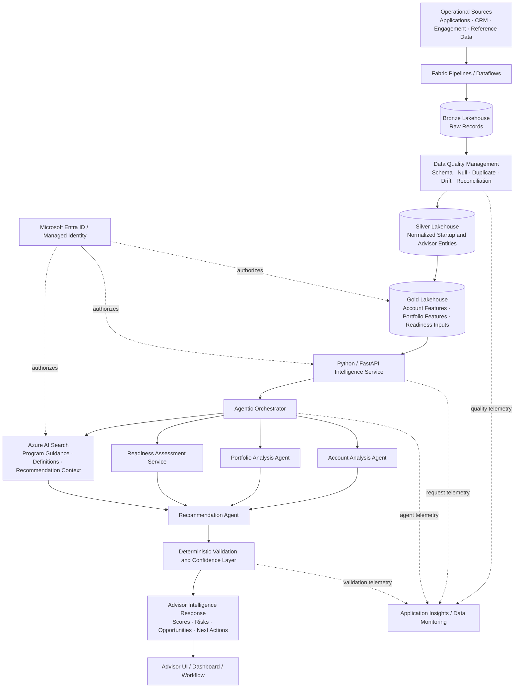
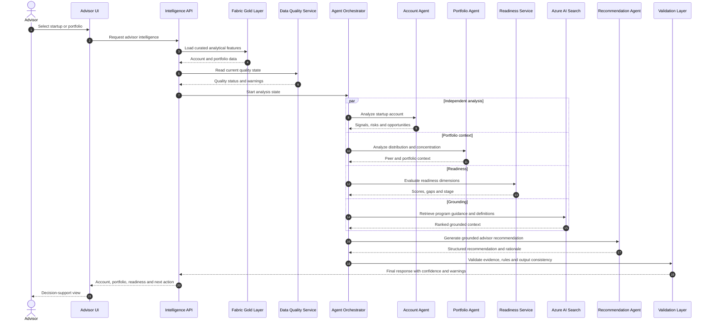
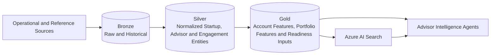
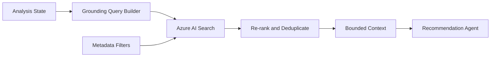
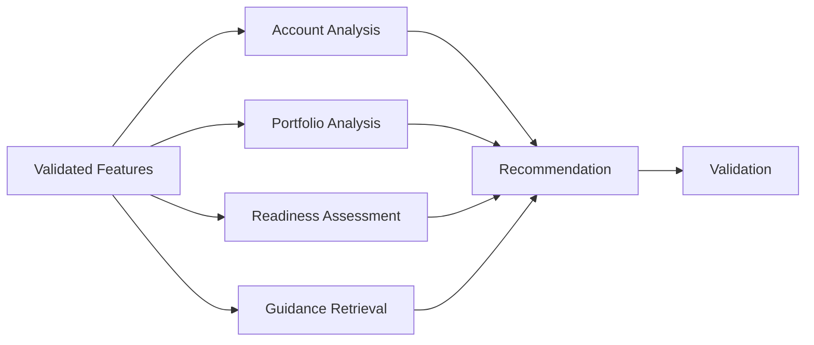
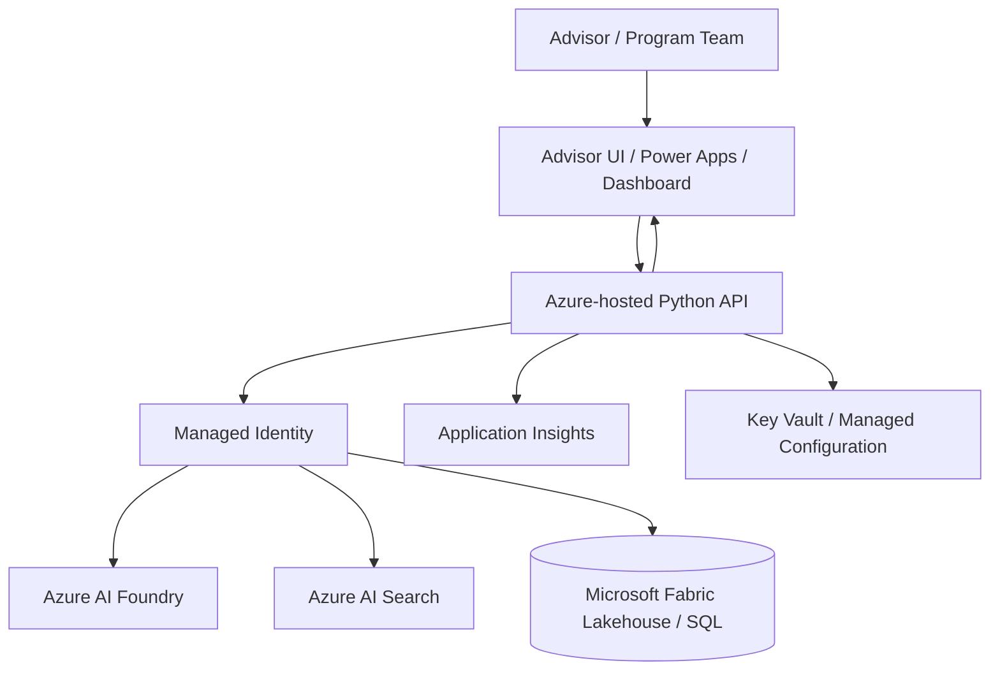

<p align="center">
  
</p>

<h1 align="center">Startup Intelligence & Advisor Platform</h1>

<p align="center">
  <strong>A multi-agent advisor-intelligence platform for startup account analysis, portfolio risk, readiness assessment, and grounded recommendations.</strong>
</p>

<p align="center">
  Azure AI Foundry · Microsoft Fabric · Azure AI Search · Data Quality Management · Python
</p>

---

> **Public-safe case study:** This README describes a sanitized enterprise implementation. Internal client and program names, startup identities, portfolio records, KPI definitions, private resources, production prompts, credentials, and endpoints are intentionally excluded.

## Overview

The **Startup Intelligence & Advisor Platform** is a governed agentic-AI system designed to help advisors and program teams understand individual startup accounts and entire startup portfolios.

It combines:

- account-level signal analysis;
- portfolio-level risk and concentration analysis;
- readiness assessment;
- opportunity and intervention prioritization;
- Microsoft Fabric Lakehouse data;
- config-driven Data Quality Management;
- Azure AI Search grounding;
- focused Azure AI Foundry agents;
- structured, reviewer-friendly recommendations.

A representative question is:

> “Which startups are most ready for the next engagement stage, where is portfolio risk concentrated, and what should the advisor do next?”

The platform does not rely on one monolithic prompt. Data preparation, deterministic scoring, retrieval, agent reasoning, validation, and recommendation synthesis remain separate so that the output is explainable, testable, and suitable for enterprise workflows.

---

## Hiring Signal

This project demonstrates:

- multi-agent workflow decomposition;
- advisor-intelligence product design;
- account- and portfolio-level analytics;
- governed data engineering on Microsoft Fabric;
- Data Quality Management;
- readiness and risk scoring;
- Azure AI Search grounding;
- Azure AI Foundry orchestration;
- recommendation-system design;
- typed Python contracts;
- human-in-the-loop decision support;
- enterprise Azure integration.

---

## Table of Contents

1. [Problem Statement](#problem-statement)
2. [Business Context](#business-context)
3. [Objectives and Non-Goals](#objectives-and-non-goals)
4. [Impact Snapshot](#impact-snapshot)
5. [My Role](#my-role)
6. [Solution Overview](#solution-overview)
7. [High-Level Design](#high-level-design)
8. [End-to-End Workflow](#end-to-end-workflow)
9. [Agent Architecture](#agent-architecture)
10. [Low-Level Design](#low-level-design)
11. [Account-Level Intelligence](#account-level-intelligence)
12. [Portfolio-Level Intelligence](#portfolio-level-intelligence)
13. [Readiness Assessment](#readiness-assessment)
14. [Recommendation Engine](#recommendation-engine)
15. [Data Foundation and DQM](#data-foundation-and-dqm)
16. [Retrieval and Grounding](#retrieval-and-grounding)
17. [API and Data Contracts](#api-and-data-contracts)
18. [Validation and Reliability](#validation-and-reliability)
19. [Human-in-the-Loop Design](#human-in-the-loop-design)
20. [Security and Governance](#security-and-governance)
21. [Observability](#observability)
22. [Error Handling](#error-handling)
23. [Performance Engineering](#performance-engineering)
24. [Technology Stack](#technology-stack)
25. [Representative Repository Structure](#representative-repository-structure)
26. [Running the Solution](#running-the-solution)
27. [Testing Strategy](#testing-strategy)
28. [Deployment Model](#deployment-model)
29. [Example Workflow Traces](#example-workflow-traces)
30. [Challenges and Resolutions](#challenges-and-resolutions)
31. [Engineering Decisions](#engineering-decisions)
32. [Limitations](#limitations)
33. [Future Enhancements](#future-enhancements)
34. [Impact Statement](#impact-statement)

---

## Problem Statement

Startup advisors and program teams often manage many accounts at different maturity levels. A useful recommendation requires more than reading one application record. The advisor may need to understand:

- current account engagement;
- startup maturity and traction;
- funding and ecosystem signals;
- product and market readiness;
- support history;
- outstanding blockers;
- data completeness;
- portfolio concentration;
- advisor workload and prioritization.

This information is usually fragmented across operational systems, Fabric tables, program guidance, support records, and manually maintained notes.

### Business Problem

Advisors need consistent answers to questions such as:

- Which startups are ready for deeper engagement?
- Which accounts have strong potential but low touch?
- Where is risk concentrated in the portfolio?
- Which startups require intervention?
- Which recommendation is supported by available evidence?
- Which data gap prevents a confident recommendation?
- How should the advisor prioritize the next action?

Manual review is repetitive, varies by reviewer, and makes portfolio-wide patterns difficult to see.

### Technical Problem

Build an enterprise platform that can:

1. create a governed startup-data foundation;
2. validate source-data quality;
3. analyze an individual account;
4. analyze the advisor's portfolio;
5. calculate readiness and risk signals;
6. retrieve trusted guidance and definitions;
7. coordinate specialized agents;
8. generate grounded recommendations;
9. preserve evidence, confidence, and warnings;
10. keep the advisor in control of the final decision.

---

## Business Context

The platform supports four related intelligence views.

### Account Intelligence

Provides a detailed assessment of one startup:

- profile and evidence completeness;
- maturity and traction signals;
- engagement and touch status;
- funding and ecosystem indicators;
- readiness dimensions;
- risks and blockers;
- recommended next action.

### Portfolio Intelligence

Aggregates account-level results to identify:

- portfolio concentration;
- readiness distribution;
- risk distribution;
- engagement gaps;
- opportunity segments;
- advisor workload priorities;
- accounts with stale or missing evidence.

### Readiness Assessment

Evaluates governed dimensions such as:

- product readiness;
- market readiness;
- technical readiness;
- program readiness;
- engagement readiness;
- evidence completeness.

The exact production dimensions and thresholds are confidential and are represented generically here.

### Advisor Recommendations

Generates an advisor-facing next action grounded in:

- validated account data;
- portfolio context;
- retrieved program guidance;
- readiness and risk indicators;
- deterministic rules;
- agent-generated synthesis.

---

## Objectives and Non-Goals

### Objectives

- Standardize startup intelligence across advisors.
- Provide both account and portfolio analysis.
- Detect data-quality gaps before AI reasoning.
- Ground agent outputs in curated data and guidance.
- Separate deterministic scoring from model interpretation.
- Generate evidence-backed next actions.
- Return structured outputs for dashboards and workflows.
- Preserve check-level reasoning and confidence.
- Make the design modular and extensible.
- Maintain secure enterprise integration.

### Non-Goals

- Replace advisor judgment.
- Automatically execute business commitments.
- Infer missing evidence as fact.
- Let an LLM modify source records directly.
- Apply one opaque score to every startup.
- Expose confidential startup or investor data.
- Treat model confidence as a guarantee.
- Use unvalidated public evidence as the only decision source.

---

## Impact Snapshot

| Area | Outcome |
|---|---|
| Advisor workflow | Unified account, portfolio, readiness, and recommendation views |
| Consistency | Standardized analysis across startup accounts |
| Portfolio visibility | Surfaced concentration, risk, and opportunity patterns |
| Data trust | Added Fabric-based DQM checks before agent reasoning |
| Grounding | Used Azure AI Search over curated business context |
| Modularity | Decomposed account, portfolio, readiness, and recommendation responsibilities |
| Decision support | Returned actionable next steps with evidence and warnings |
| Reuse | Created a foundation for additional startup programs and advisor teams |

> No unsupported numerical accuracy or productivity claim is included. Exact client outcomes are confidential or were not explicitly established in the publish-safe context.

---

## My Role

I worked across the agentic architecture, data foundation, orchestration, validation, and recommendation layers.

### Architecture

- Designed the separation between account analysis, portfolio analysis, readiness assessment, and recommendation generation.
- Defined deterministic and agentic responsibilities.
- Structured the flow from Fabric data to advisor-facing output.
- Designed a reusable pattern that could support additional startup programs.

### Agentic Workflow

- Contributed to multi-agent decomposition.
- Defined focused agent responsibilities.
- Supported parallel processing of independent analysis branches.
- Designed structured agent outputs that could be merged safely.
- Added final synthesis and recommendation logic.

### Microsoft Fabric and Data Quality

- Supported the Fabric Lakehouse foundation.
- Worked with curated medallion-style data layers.
- Integrated config-driven DQM checks before analysis.
- Helped normalize startup, advisor, portfolio, and engagement data.
- Preserved data-quality warnings in downstream responses.

### Retrieval and Grounding

- Integrated Azure AI Search for program guidance, definitions, and recommendation context.
- Added context filtering to reduce unrelated retrieval.
- Preserved source references for explainability.

### Recommendation and Validation

- Designed structured recommendation outputs for advisors.
- Kept hard rules and validation outside the LLM.
- Added confidence, missing-data, and manual-review states.
- Prevented unsupported recommendations when evidence was insufficient.

### Backend and Delivery

- Worked with Python services and typed JSON contracts.
- Supported Azure-native integration and environment configuration.
- Contributed to testing, debugging, stakeholder walkthroughs, and knowledge transfer.

---

## Solution Overview

The platform uses a governed data-to-decision pipeline.

1. **Data ingestion** — Load startup, engagement, portfolio, program, and reference records.
2. **Data quality validation** — Run schema, completeness, uniqueness, integrity, freshness, and reconciliation checks.
3. **Feature preparation** — Build normalized account and portfolio signals.
4. **Account analysis** — Evaluate the current state of one startup.
5. **Portfolio analysis** — Compare accounts and identify concentration and workload patterns.
6. **Readiness assessment** — Calculate governed readiness dimensions and identify gaps.
7. **Knowledge retrieval** — Retrieve approved guidance, definitions, and recommendation criteria.
8. **Recommendation synthesis** — Combine deterministic results with grounded agent reasoning.
9. **Validation and output** — Return a structured advisor-intelligence response.

---

## High-Level Design



### Architectural Boundaries

| Layer | Responsibility |
|---|---|
| Source Layer | Startup, portfolio, engagement, and reference records |
| Data Engineering Layer | Ingestion and transformation |
| DQM Layer | Data-quality gates and issue reporting |
| Feature Layer | Account and portfolio analytical features |
| API Layer | Secure typed service interface |
| Orchestration Layer | Agent routing, state, and parallelism |
| Retrieval Layer | Curated guidance and metadata |
| Agent Layer | Account, portfolio, and recommendation reasoning |
| Validation Layer | Deterministic checks and confidence |
| Experience Layer | Advisor-facing response or dashboard |
| Observability Layer | Quality, latency, errors, and traceability |

---

## End-to-End Workflow



---

## Agent Architecture

The public-safe architecture contains four focused analytical responsibilities.

| Component | Responsibility |
|---|---|
| Account Analysis Agent | Analyze one startup's current state, signals, risks, and gaps |
| Portfolio Analysis Agent | Evaluate portfolio distribution, concentration, and peer context |
| Readiness Assessment Service | Calculate governed readiness dimensions and missing evidence |
| Recommendation Agent | Convert validated findings into an actionable next step |

Supporting deterministic services include:

- data-quality service;
- feature service;
- Azure AI Search retriever;
- output validator;
- confidence and routing service.

### Why Decompose the Workflow?

- Account and portfolio analysis use different context.
- Readiness values should remain explainable.
- Independent branches can run in parallel.
- Each output can be evaluated separately.
- The recommendation agent receives validated facts instead of raw records.
- Failures can be isolated.
- New analytical capabilities can be added without replacing the entire system.

---

## Low-Level Design

### Core Components

| Component | Responsibility |
|---|---|
| Advisor Intelligence API | Receive account or portfolio requests |
| Fabric Repository | Read curated startup and portfolio data |
| Quality Repository | Retrieve DQM status |
| Feature Resolver | Prepare account and portfolio features |
| Agent Orchestrator | Run independent analysis branches |
| Account Agent | Evaluate startup-specific signals |
| Portfolio Agent | Calculate portfolio context |
| Readiness Service | Compute governed readiness outputs |
| Search Service | Retrieve approved business guidance |
| Recommendation Agent | Produce the advisor next action |
| Output Validator | Enforce response and evidence contracts |
| Telemetry Service | Capture stage, quality, and latency metrics |

### Request Schema

```python
from typing import Literal
from pydantic import BaseModel, Field


class AdvisorIntelligenceRequest(BaseModel):
    request_type: Literal[
        "account",
        "portfolio",
        "account_with_portfolio_context",
    ]
    advisor_id: str
    startup_id: str | None = None
    portfolio_id: str | None = None

    requested_outputs: list[str] = Field(
        default_factory=lambda: [
            "account_analysis",
            "readiness",
            "recommendation",
        ]
    )
    include_evidence: bool = True
    include_portfolio_benchmark: bool = True
```

### Orchestration State

```python
from typing import Any
from pydantic import BaseModel, Field


class AdvisorIntelligenceState(BaseModel):
    correlation_id: str
    request: AdvisorIntelligenceRequest

    account_features: dict[str, Any] = Field(default_factory=dict)
    portfolio_features: dict[str, Any] = Field(default_factory=dict)
    data_quality: dict[str, Any] = Field(default_factory=dict)

    account_analysis: dict[str, Any] | None = None
    portfolio_analysis: dict[str, Any] | None = None
    readiness_assessment: dict[str, Any] | None = None

    retrieved_context: list[dict[str, Any]] = Field(default_factory=list)
    recommendation: dict[str, Any] | None = None

    confidence: float | None = None
    warnings: list[str] = Field(default_factory=list)
    errors: list[dict[str, str]] = Field(default_factory=list)
    status: str = "running"
```

### Orchestration Pattern

```python
async def build_advisor_intelligence(
    request: AdvisorIntelligenceRequest,
) -> AdvisorIntelligenceState:
    state = AdvisorIntelligenceState(
        correlation_id=create_correlation_id(),
        request=request,
    )

    features, quality = await asyncio.gather(
        feature_service.load(request),
        quality_service.load(request),
    )

    state.account_features = features.account
    state.portfolio_features = features.portfolio
    state.data_quality = quality.model_dump()

    branch_results = await asyncio.gather(
        account_agent.analyze(state),
        portfolio_agent.analyze(state),
        readiness_service.assess(state),
        search_service.retrieve(state),
        return_exceptions=True,
    )

    apply_branch_results(state, branch_results)
    state.recommendation = await recommendation_agent.generate(state)
    validate_final_state(state)

    return state
```

---

## Account-Level Intelligence

The account-analysis branch evaluates the state of one startup.

### Representative Signal Groups

- profile completeness;
- engagement or touch status;
- funding indicators;
- traction signals;
- product maturity;
- technical adoption indicators;
- ecosystem activity;
- prior advisor actions;
- blockers;
- data-quality warnings.

### Example Output

```json
{
  "startup_id": "startup-101",
  "account_health": "Moderate",
  "opportunity_level": "High",
  "risk_level": "Medium",
  "strengths": [
    "Strong product signal",
    "Positive engagement trend"
  ],
  "risks": [
    "Incomplete market-readiness evidence"
  ],
  "missing_information": [
    "Updated readiness documentation"
  ],
  "evidence_refs": [
    "feature-record-11",
    "engagement-record-08"
  ]
}
```

### Boundaries

The account agent may interpret validated features, but it does not:

- invent source values;
- modify Fabric records;
- override DQM failures;
- claim unsupported causal relationships;
- independently assign the final workflow action.

---

## Portfolio-Level Intelligence

Portfolio analysis identifies patterns that cannot be seen from one account.

### Representative Capabilities

- readiness distribution;
- risk distribution;
- concentration analysis;
- engagement gaps;
- high-potential, low-touch accounts;
- stale or missing evidence;
- advisor workload segmentation;
- peer comparison;
- opportunity clusters.

### Example Output

```json
{
  "portfolio_id": "portfolio-22",
  "startup_count": 128,
  "readiness_distribution": {
    "high": 31,
    "medium": 69,
    "low": 28
  },
  "risk_distribution": {
    "high": 18,
    "medium": 54,
    "low": 56
  },
  "concentration_flags": [
    {
      "dimension": "solution_area",
      "value": "Example Area",
      "share": 0.42
    }
  ],
  "priority_segments": [
    "High opportunity / low engagement",
    "Medium readiness / fixable evidence gap"
  ]
}
```

All numbers in this example are synthetic and illustrate the contract only.

### How Portfolio Context Changes Priority

An account can receive a different priority when:

- many similar accounts are already heavily engaged;
- the account is unusually strong compared with peers;
- the portfolio is concentrated in one segment;
- advisor capacity should prioritize urgent-risk accounts;
- an account fills a strategic portfolio gap.

---

## Readiness Assessment

Readiness is evaluated through governed dimensions rather than one opaque model score.

### Representative Dimensions

| Dimension | Example Meaning |
|---|---|
| Product Readiness | Product maturity and usable offering |
| Market Readiness | Market positioning and evidence of demand |
| Technical Readiness | Technical integration or adoption preparedness |
| Program Readiness | Alignment with program requirements |
| Engagement Readiness | Ability to benefit from advisor action now |
| Evidence Completeness | Availability and freshness of supporting data |

### Contracts

```python
from typing import Literal
from pydantic import BaseModel, Field


class ReadinessDimension(BaseModel):
    name: str
    score: float = Field(ge=0, le=100)
    level: Literal["low", "medium", "high"]
    reason: str
    evidence_refs: list[str] = Field(default_factory=list)
    missing_inputs: list[str] = Field(default_factory=list)


class ReadinessAssessment(BaseModel):
    overall_score: float = Field(ge=0, le=100)
    overall_level: Literal["low", "medium", "high"]
    dimensions: list[ReadinessDimension]
    blocking_gaps: list[str] = Field(default_factory=list)
    confidence: float = Field(ge=0, le=1)
```

### Responsibility Split

Deterministic services:

- normalize inputs;
- calculate feature values;
- apply configured thresholds;
- detect missing fields;
- enforce score bounds.

Agent reasoning:

- explain the combination of signals;
- summarize strengths and blockers;
- identify the most relevant advisor action;
- avoid changing calculated values.

---

## Recommendation Engine

The recommendation engine combines validated account, portfolio, readiness, and guidance outputs.

### Representative Recommendation States

```text
Prioritize Now
Nurture
Collect More Evidence
Advisor Review
Monitor
Deprioritize
```

These values are public-safe examples. Production workflow names may differ.

### Contract

```python
from typing import Literal
from pydantic import BaseModel, Field


class AdvisorRecommendation(BaseModel):
    action: Literal[
        "Prioritize Now",
        "Nurture",
        "Collect More Evidence",
        "Advisor Review",
        "Monitor",
        "Deprioritize",
    ]
    priority: Literal["low", "medium", "high"]
    rationale: str
    recommended_steps: list[str]
    evidence_refs: list[str] = Field(default_factory=list)
    risks: list[str] = Field(default_factory=list)
    confidence: float = Field(ge=0, le=1)
```

### Decision Precedence

```text
Critical data-quality failure
  > Hard eligibility or risk block
  > Missing required evidence
  > Readiness assessment
  > Portfolio-priority context
  > Agent recommendation
```

A low-quality record cannot receive a high-confidence action recommendation.

---

## Data Foundation and DQM

### Medallion Architecture



### Bronze Layer

Stores:

- source-aligned records;
- ingestion timestamps;
- raw application and engagement fields;
- history;
- source identifiers.

### Silver Layer

Applies:

- schema normalization;
- startup and advisor entity resolution;
- URL and name normalization;
- status standardization;
- duplicate handling;
- reference-data joins.

### Gold Layer

Provides:

- account-level features;
- portfolio aggregates;
- readiness inputs;
- risk indicators;
- advisor-facing analytical tables;
- documents used to populate Search indexes.

### Data Quality Checks

- required-field completeness;
- duplicate primary keys;
- startup entity uniqueness;
- schema drift;
- data-type consistency;
- valid status values;
- referential integrity;
- freshness thresholds;
- count reconciliation;
- feature-range validation.

### Quality Contract

```python
class DataQualityStatus(BaseModel):
    status: str
    passed_checks: list[str]
    warnings: list[str]
    failed_checks: list[str]
    freshness_timestamp: str | None
    can_generate_recommendation: bool
```

### Quality Routing

| Quality State | Behavior |
|---|---|
| Healthy | Run full analysis |
| Warning | Run with reduced confidence and explicit warning |
| Blocking failure | Stop recommendation and request correction |
| Stale data | Mark output as stale and route for review |
| Partial portfolio data | Return account analysis without unsupported portfolio inference |

---

## Retrieval and Grounding

Azure AI Search provides curated context such as:

- program definitions;
- readiness guidance;
- recommendation playbooks;
- account and portfolio terminology;
- eligibility and risk explanations;
- approved next-action definitions;
- methodology documentation.

### Retrieval Pipeline



### Grounding Rules

- use approved indexes only;
- retain document and section identifiers;
- filter by program and domain;
- bound context size;
- do not treat weak retrieval as authoritative;
- lower confidence when guidance is missing;
- distinguish retrieved evidence from model inference.

---

## API and Data Contracts

### Endpoint

```text
POST /api/v1/advisor-intelligence
```

### Request Example

```json
{
  "request_type": "account_with_portfolio_context",
  "advisor_id": "advisor-17",
  "startup_id": "startup-101",
  "portfolio_id": "portfolio-22",
  "requested_outputs": [
    "account_analysis",
    "portfolio_analysis",
    "readiness",
    "recommendation"
  ],
  "include_evidence": true,
  "include_portfolio_benchmark": true
}
```

### Response Schema

```python
class AdvisorIntelligenceResponse(BaseModel):
    request_id: str
    status: str

    account_analysis: dict | None = None
    portfolio_analysis: dict | None = None
    readiness: ReadinessAssessment | None = None
    recommendation: AdvisorRecommendation | None = None

    data_quality: DataQualityStatus
    sources: list[dict] = Field(default_factory=list)
    warnings: list[str] = Field(default_factory=list)
    errors: list[dict[str, str]] = Field(default_factory=list)
    latency_ms: int
```

### Response Example

```json
{
  "request_id": "req-a91f",
  "status": "success",
  "account_analysis": {
    "account_health": "Moderate",
    "opportunity_level": "High",
    "risk_level": "Medium",
    "strengths": [
      "Strong engagement signal"
    ],
    "risks": [
      "Readiness evidence is incomplete"
    ]
  },
  "portfolio_analysis": {
    "priority_segment": "High opportunity / low engagement",
    "peer_percentile": 82
  },
  "readiness": {
    "overall_score": 72,
    "overall_level": "medium",
    "dimensions": [],
    "blocking_gaps": [
      "Missing current market-readiness evidence"
    ],
    "confidence": 0.86
  },
  "recommendation": {
    "action": "Collect More Evidence",
    "priority": "high",
    "rationale": "The account has strong opportunity signals but lacks a current readiness artifact.",
    "recommended_steps": [
      "Request updated readiness evidence",
      "Schedule an advisor follow-up after validation"
    ],
    "evidence_refs": [
      "feature-record-11",
      "guidance-document-05"
    ],
    "risks": [],
    "confidence": 0.84
  },
  "data_quality": {
    "status": "warning",
    "passed_checks": [
      "schema",
      "uniqueness"
    ],
    "warnings": [
      "One readiness input is stale"
    ],
    "failed_checks": [],
    "freshness_timestamp": "2025-01-01T00:00:00Z",
    "can_generate_recommendation": true
  },
  "sources": [],
  "warnings": [],
  "errors": [],
  "latency_ms": 5400
}
```

All values are synthetic and illustrate the interface only.

---

## Validation and Reliability

### Data Contract Validation

- required identifiers;
- supported request type;
- score bounds;
- supported recommendation state;
- valid evidence references;
- no unsupported null combinations;
- DQM state present.

### Cross-Component Validation

```python
if not state.data_quality["can_generate_recommendation"]:
    assert state.recommendation is None

if state.recommendation:
    assert state.readiness_assessment is not None
    assert state.recommendation["evidence_refs"]
```

### Recommendation Validation

A recommendation must:

- use a supported action;
- reference validated signals;
- include a rationale;
- include concrete next steps;
- expose relevant risks;
- respect hard blocks;
- reduce confidence when quality warnings exist.

### Partial Success

The platform can return:

- account analysis without portfolio context;
- readiness assessment without a final recommendation;
- portfolio analysis with quality warnings;
- recommendation with reduced confidence when an optional dependency fails.

It does not fabricate the missing branch.

---

## Human-in-the-Loop Design

The platform supports advisors rather than replacing them.

### Advisor Controls

- inspect evidence;
- accept or change the next action;
- add notes;
- request missing information;
- flag incorrect source data;
- record an override reason.

### Override Audit

A manual override should preserve:

- original recommendation;
- final advisor action;
- reviewer identity;
- timestamp;
- reason;
- changed fields;
- supporting evidence;
- model, rule, and data versions.

### Feedback Loop

Reviewer feedback can improve:

- readiness thresholds;
- recommendation rules;
- retrieval quality;
- source coverage;
- confidence calibration;
- agent prompts.

---

## Security and Governance

### Identity

- Microsoft Entra ID-based access;
- managed identity for Azure service calls;
- role-based advisor access;
- least-privilege permissions.

### Data Protection

- startup records remain in approved systems;
- only required features are passed to agents;
- sensitive fields are excluded from prompts;
- evidence references use governed identifiers;
- outputs are stored with controlled access.

### AI Governance

- deterministic scores are separate from explanations;
- agent outputs are schema-validated;
- unsupported recommendations are blocked;
- retrieved context is bounded;
- prompt, rule, and model versions should be recorded;
- recommendations remain advisory.

### Network

- HTTPS-only APIs;
- private access patterns where required;
- no direct browser access to Fabric or Search;
- restricted service-to-service connectivity.

---

## Observability

Each request uses a correlation ID.

| Area | Examples |
|---|---|
| Request | request type, startup ID hash, portfolio ID hash |
| Fabric | query duration, row counts, feature version |
| DQM | passed, warning, and failed checks |
| Agent | agent name, duration, output status |
| Search | index, result count, selected source IDs |
| Readiness | dimension status and missing-input count |
| Recommendation | action, confidence, rule path |
| Performance | total and stage latency |
| Failure | safe dependency category and recoverability |
| Feedback | accepted, overridden, or rejected recommendation |

Production logs must not contain private startup records, credentials, or unrestricted prompt contents.

---

## Error Handling

| Failure | Controlled Behavior |
|---|---|
| Missing startup ID | Return request-validation error |
| Startup not found | Return controlled not-found state |
| Portfolio unavailable | Return account-only partial success |
| Blocking DQM failure | Stop recommendation and request correction |
| Stale data | Return warning and reduce confidence |
| Search unavailable | Use deterministic analysis and mark grounding unavailable |
| Account agent fails | Preserve portfolio and readiness branches |
| Portfolio agent fails | Preserve account analysis |
| Readiness cannot be calculated | Return advisor-review state |
| Invalid agent JSON | Retry with schema feedback |
| Unsupported recommendation | Reject before response |
| Fabric timeout | Retry only when transient |
| Identity or RBAC failure | Return dependency-authentication error |
| Unexpected exception | Log correlation ID and return safe failure |

---

## Performance Engineering

### Optimizations

- precompute account and portfolio features in Fabric;
- retrieve only required columns;
- run account, portfolio, readiness, and search branches concurrently;
- cache stable guidance documents;
- use bounded context;
- avoid sending raw portfolio records to the LLM;
- reuse normalized analytical state;
- skip unrequested output branches;
- separate deterministic scoring from model calls.

### Parallel Execution



---

## Technology Stack

| Area | Technology |
|---|---|
| Language | Python |
| Agent Platform | Azure AI Foundry |
| LLM | Azure OpenAI / Foundry deployments |
| Data Platform | Microsoft Fabric |
| Storage | Fabric Lakehouse / Delta |
| Data Engineering | PySpark, SQL, Pipelines, Dataflows |
| Data Quality | Config-driven DQM checks |
| Retrieval | Azure AI Search |
| Backend | FastAPI or Azure-native Python service |
| Contracts | Pydantic and JSON |
| Orchestration | Async Python and multi-agent workflows |
| Identity | Microsoft Entra ID |
| Authentication | Managed Identity |
| Authorization | Azure RBAC |
| Monitoring | Application Insights / Azure Monitor |
| Experience | Advisor dashboard, Power Apps, or operational portal |

---

## Representative Repository Structure

```text
startup-intelligence-advisor-platform/
├── assets/
│   └── startup-intelligence-advisor-platform.png
├── app/
│   ├── main.py
│   ├── api/
│   │   ├── routes.py
│   │   └── dependencies.py
│   ├── contracts/
│   │   ├── requests.py
│   │   ├── responses.py
│   │   ├── readiness.py
│   │   └── recommendation.py
│   ├── orchestration/
│   │   ├── coordinator.py
│   │   ├── branch_runner.py
│   │   └── state.py
│   ├── agents/
│   │   ├── account_analysis.py
│   │   ├── portfolio_analysis.py
│   │   └── recommendation.py
│   ├── readiness/
│   │   ├── feature_rules.py
│   │   ├── scorer.py
│   │   └── validator.py
│   ├── retrieval/
│   │   ├── azure_search.py
│   │   └── context_builder.py
│   ├── data/
│   │   ├── fabric_repository.py
│   │   ├── feature_service.py
│   │   └── quality_repository.py
│   ├── validation/
│   │   ├── output_validator.py
│   │   └── confidence.py
│   ├── security/
│   │   └── identity.py
│   └── observability/
│       ├── logging.py
│       └── telemetry.py
├── fabric/
│   ├── notebooks/
│   ├── pipelines/
│   ├── dqm/
│   │   ├── rules/
│   │   └── checks.py
│   └── sql/
│       ├── account_features.sql
│       └── portfolio_features.sql
├── tests/
│   ├── unit/
│   ├── integration/
│   ├── contract/
│   ├── golden/
│   └── fixtures/
├── Dockerfile
├── pyproject.toml
├── .env.example
└── README.md
```

---

## Running the Solution

### 1. Create an Environment

```bash
python -m venv .venv
```

```bash
# Windows
.venv\Scripts\activate
```

```bash
# macOS / Linux
source .venv/bin/activate
```

### 2. Install Dependencies

```bash
pip install -r requirements.txt
```

### 3. Configure Environment

Representative variables:

```text
AZURE_CLIENT_ID
FOUNDRY_PROJECT_ENDPOINT
AZURE_SEARCH_ENDPOINT
FABRIC_SQL_ENDPOINT
PROGRAM_GUIDANCE_INDEX
APPLICATIONINSIGHTS_CONNECTION_STRING
```

Use managed identity in deployed Azure environments wherever possible. Never commit credentials.

### 4. Run the API

```bash
uvicorn app.main:app --reload
```

### 5. Call the Endpoint

```bash
curl -X POST "http://localhost:8000/api/v1/advisor-intelligence" \
  -H "Content-Type: application/json" \
  -d @samples/advisor-intelligence-request.json
```

---

## Testing Strategy

### Unit Tests

- request validation;
- startup and portfolio feature normalization;
- readiness thresholds;
- DQM routing;
- recommendation precedence;
- confidence calculation;
- response serialization.

### Data Quality Tests

- null checks;
- duplicate keys;
- schema drift;
- type mismatch;
- status-value validation;
- freshness;
- count reconciliation;
- foreign-key integrity.

### Agent Tests

- strong account with complete evidence;
- high opportunity with low engagement;
- conflicting signals;
- missing evidence;
- incomplete portfolio context;
- malformed structured output;
- agent timeout.

### Retrieval Tests

- relevant guidance retrieval;
- incorrect program filter;
- weak result score;
- duplicate source documents;
- source ID preservation;
- stale guidance.

### Portfolio Tests

- concentration detection;
- readiness distribution;
- risk distribution;
- priority-segment assignment;
- peer comparison;
- empty portfolio;
- partial portfolio.

### Integration Tests

- API to Fabric;
- API to DQM status;
- API to Azure AI Search;
- API to Foundry;
- managed identity;
- Application Insights;
- UI or workflow integration.

### End-to-End Scenarios

- high-readiness startup;
- low-readiness startup;
- missing required evidence;
- healthy account in a concentrated portfolio;
- high opportunity with low engagement;
- blocking DQM failure;
- Search unavailable;
- portfolio branch failure;
- advisor override.

---

## Deployment Model



### Deployment Characteristics

- Azure-hosted Python service;
- managed identity for downstream access;
- Fabric-backed analytical features;
- Search-backed grounding;
- Foundry-based reasoning;
- environment-specific configuration;
- Application Insights telemetry;
- advisor-facing structured response.

---

## Example Workflow Traces

### High Opportunity, Missing Evidence

```text
Account analysis: High opportunity
Portfolio context: Underrepresented strategic segment
Readiness: Medium
Missing evidence: Current market-readiness artifact
Data quality: Warning, non-blocking
Recommendation: Collect More Evidence
Priority: High
```

### Ready for Immediate Advisor Action

```text
Account analysis: Healthy
Engagement: Active
Readiness: High
Portfolio context: High-value account
Risk: Low
Recommendation: Prioritize Now
Priority: High
```

### Portfolio Concentration Risk

```text
Portfolio analysis: High concentration in one solution area
Readiness distribution: Skewed toward medium
Engagement gap: Several high-potential accounts are untouched
Recommendation: Rebalance advisor attention
```

### Data Quality Blocks Recommendation

```text
Required account feature: Missing
Portfolio mapping: Failed
DQM state: Blocking
Agent recommendation: Skipped
Final state: Advisor Review
Reason: Source data must be corrected before a recommendation is generated
```

---

## Challenges and Resolutions

### Account and Portfolio Context Are Different

**Challenge:** One startup may look strong individually but have lower portfolio priority.

**Resolution:** Use separate account and portfolio branches, then combine them during recommendation synthesis.

### Inconsistent Source Data

**Challenge:** Startup, engagement, and program records may contain missing or inconsistent values.

**Resolution:** Add Fabric-based DQM gates and carry quality warnings into the response.

### Opaque Readiness Scores

**Challenge:** A model-generated readiness score is difficult to trust.

**Resolution:** Use governed dimensions, deterministic thresholds, evidence references, and an agent explanation layer.

### Generic Recommendations

**Challenge:** An LLM can produce broad advice unrelated to program context.

**Resolution:** Retrieve approved guidance through Azure AI Search and require recommendations to reference validated signals.

### Portfolio Scale

**Challenge:** Passing every raw portfolio record to an agent is expensive and unsafe.

**Resolution:** Precompute portfolio aggregates and peer features in Fabric.

### Conflicting Signals

**Challenge:** High opportunity can coexist with high risk or missing evidence.

**Resolution:** Preserve separate dimensions and use explicit decision precedence instead of averaging everything into one opaque score.

### Advisor Trust

**Challenge:** Advisors need to understand why an action was suggested.

**Resolution:** Return rationale, steps, risks, confidence, quality warnings, and evidence references.

---

## Engineering Decisions

### Fabric Before Agent Reasoning

**Decision:** Prepare and validate analytical features in Microsoft Fabric.

**Reason:** Agents should reason over governed data, not raw operational records.

### Separate Account and Portfolio Analysis

**Decision:** Isolate individual-account reasoning from portfolio analysis.

**Reason:** The two responsibilities use different context and can be tested independently.

### Deterministic Readiness Foundation

**Decision:** Compute readiness inputs and thresholds outside the LLM.

**Reason:** Readiness must be stable, explainable, and auditable.

### Retrieval-Grounded Recommendation

**Decision:** Retrieve approved advisor guidance before recommendation generation.

**Reason:** Recommendations should reflect the program's operating model.

### Quality-Aware Confidence

**Decision:** Reduce confidence or block output when source quality is poor.

**Reason:** Model fluency must not hide weak data.

### Human Override

**Decision:** Treat the output as decision support.

**Reason:** Advisors retain accountability and may have context unavailable to the system.

### Structured Response

**Decision:** Return typed sections rather than one narrative.

**Reason:** The same response can power dashboards, workflow automation, audit views, and downstream services.

---

## Limitations

- Recommendation quality depends on source-data freshness and completeness.
- Readiness thresholds require business-owner governance.
- Portfolio analysis can be misleading when account coverage is incomplete.
- Some strategic context may exist only in advisor knowledge.
- Search indexes must be refreshed when guidance changes.
- Public documentation cannot include confidential startup or portfolio records.
- The system supports decisions but does not establish causal business outcomes.
- This repository represents a sanitized enterprise case study.

---

## Future Enhancements

- Add advisor feedback learning.
- Track recommendation acceptance and downstream outcomes.
- Add time-series readiness trends.
- Add portfolio simulation and capacity planning.
- Add explainable peer-group selection.
- Improve entity resolution across startup aliases.
- Add automated stale-data detection.
- Add configurable program-specific readiness dimensions.
- Stream analysis progress to the UI.
- Expose advisor intelligence through MCP.
- Add structured action-plan generation.
- Add recommendation-quality evaluation dashboards.
- Add scenario comparison for advisor strategies.
- Add automated alerts for risk and opportunity changes.

---

## Impact Statement

The Startup Intelligence & Advisor Platform created a governed bridge between startup data, portfolio analytics, and advisor decision support.

The architecture:

- unified account-level and portfolio-level intelligence;
- standardized readiness assessment;
- introduced data-quality gates before AI reasoning;
- grounded recommendations in approved business context;
- separated specialized analytical responsibilities;
- enabled structured and explainable next actions;
- surfaced concentration, risk, and opportunity patterns;
- helped advisors focus on priority accounts and exceptions;
- created a reusable foundation for additional programs and teams.

---

## Portfolio Summary

> Built a sanitized startup advisor-intelligence platform using Azure AI Foundry, Microsoft Fabric, Azure AI Search, and config-driven DQM. The system combines account analysis, portfolio analysis, readiness assessment, risk detection, and grounded recommendation generation into a structured advisor-facing workflow.

---

## Contact

**Satnam Singh**  
Agentic GenAI Developer · Python Backend Developer · Microsoft Fabric and Azure AI Engineer

- Portfolio: `satnamsingh.in`
- LinkedIn: `linkedin.com/in/22satnam`
- GitHub: `github.com/22satnam`
- Email: `satnamsjob@gmail.com`

---

<p align="center">
  <strong>Analyze. Assess. Advise.</strong>
</p>
